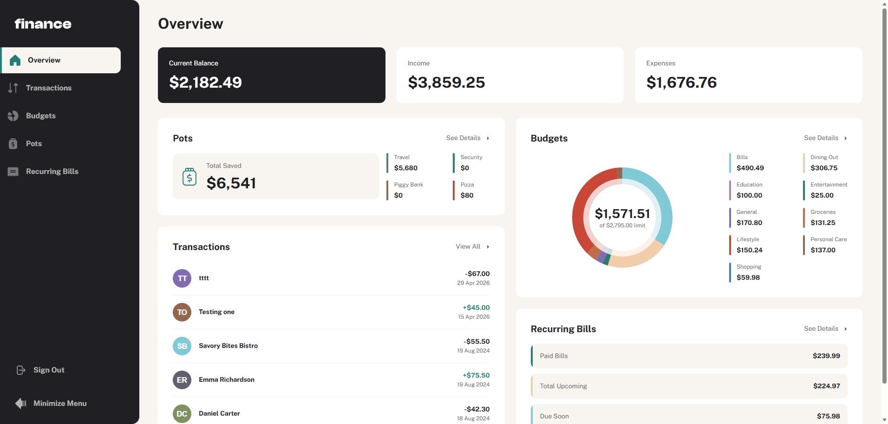

# Frontend Mentor - Personal finance app solution

This is a solution to the [Personal finance app challenge on Frontend Mentor](https://www.frontendmentor.io/challenges/personal-finance-app-JfjtZgyMt1). Frontend Mentor challenges help you improve your coding skills by building realistic projects. 

## Table of contents

- [Frontend Mentor - Personal finance app solution](#frontend-mentor---personal-finance-app-solution)
  - [Table of contents](#table-of-contents)
  - [Overview](#overview)
    - [The challenge](#the-challenge)
    - [Screenshot](#screenshot)
    - [Links](#links)
  - [My process](#my-process)
    - [Built with](#built-with)
    - [What I learned](#what-i-learned)
      - [Angular Signals](#angular-signals)
      - [Signal-Based Forms (Experimental)](#signal-based-forms-experimental)
      - [`linkedSignal` and `resource()`](#linkedsignal-and-resource)
      - [Working with the Angular MCP Server and AI Tools](#working-with-the-angular-mcp-server-and-ai-tools)
    - [Continued development](#continued-development)
  - [Author](#author)

## Overview

### The challenge

Users should be able to:

- See all of the personal finance app data at-a-glance on the overview page
- View all transactions on the transactions page with pagination for every ten transactions
- Search, sort, and filter transactions
- Create, read, update, delete (CRUD) budgets and saving pots
- View the latest three transactions for each budget category created
- View progress towards each pot
- Add money to and withdraw money from pots
- View recurring bills and the status of each for the current month
- Search and sort recurring bills
- Receive validation messages if required form fields aren't completed
- Navigate the whole app and perform all actions using only their keyboard
- View the optimal layout for the interface depending on their device's screen size
- See hover and focus states for all interactive elements on the page
- **Bonus**: Save details to a database (build the project as a full-stack app)
- **Bonus**: Create an account and log in (add user authentication to the full-stack app)

### Screenshot



### Links

- Solution URL: [Add solution URL here](https://your-solution-url.com)
- Live Site URL: [Add live site URL here](https://your-live-site-url.com)

## My process

### Built with

- [Tailwind CSS](https://tailwindcss.com)
- [Angular](https://angular.dev/)

### What I learned

Working through this project gave me deep hands-on experience with modern Angular patterns, particularly the reactive primitives introduced in recent versions.

#### Angular Signals

Signals became the backbone of state management throughout this app. Instead of relying on RxJS subjects or `BehaviorSubject` for local component state, I found `signal()` and `computed()` far more readable and predictable.

```ts
// Tracking filtered transactions reactively
readonly searchQuery = signal('');
readonly filteredTransactions = computed(() =>
  this.transactions().filter(t =>
    t.name.toLowerCase().includes(this.searchQuery().toLowerCase())
  )
);
```

`effect()` was also useful for side effects that needed to react to signal changes without manually subscribing and unsubscribing:

```ts
effect(() => {
  console.log('Query changed:', this.searchQuery());
});
```

#### Signal-Based Forms (Experimental)

I explored the new signal-based forms API which is a significant departure from the classic `ReactiveFormsModule`. Rather than `FormControl` wrapping observables, form state is exposed as signals, making template binding and validation status much more ergonomic.

```ts
const nameControl = new FormField('', {
  validators: [Validators.required, Validators.minLength(3)]
});

// Access value and validity as signals
nameControl.value();
nameControl.valid();
```

This made conditional UI rendering based on form state much simpler. The verbose `form.get('name')?.errors` chains were no longer needed.

#### `linkedSignal` and `resource()`

`linkedSignal` was invaluable for derived state that also needs to be writable. A common use case was resetting a selection whenever the parent list changed:

```ts
readonly selectedCategory = linkedSignal(() => this.categories()[0]);
```

The new `resource()` API streamlined async data fetching by combining loading, error, and value states into a single reactive primitive, removing a lot of boilerplate compared to manually managing loading flags alongside observables.

#### Working with the Angular MCP Server and AI Tools

One of the most productivity-boosting aspects of this project was integrating the **Angular CLI MCP server** with GitHub Copilot inside VS Code. This gave the AI assistant direct access to Angular-specific tooling. It could run builds, execute tests, and query Angular documentation all without leaving the editor.

Some highlights:
- Used `get_best_practices` to get version-specific Angular guidance before writing any new component or service.
- Used `search_documentation` and `find_examples` to quickly look up signal APIs and routing patterns.
- Copilot could trigger `ng test` and surface failing specs inline, making the feedback loop extremely tight.
- AI-assisted refactoring from `BehaviorSubject`-based services to signal-based ones was dramatically faster with the MCP tooling providing real-time context about the codebase.

The combination of Angular's new reactivity model and AI tooling that understands Angular deeply made this one of the most efficient projects I've worked on.

### Continued development

More into Angular Testing features and signal based testing.

## Author

- Github - [webguy83](https://github.com/webguy83)
- Frontend Mentor - [@webguy83](https://www.frontendmentor.io/profile/webguy83)
